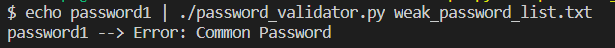

# password_validator

## Background

[NIST](https://www.nist.gov/) recently updates their [Digital Identity Guidelines](https://pages.nist.gov/800-63-3/) in June 2017.
The new guidelines specify general rules for handling the security of user supplied passwords.
Previously passwords were suggested to have certain composition rules (special characters, numbers, etc), hints and expiration times.
Those have gone out the window and the new suggestions are as follows:

Passwords MUST

1. Have an 8 character minimum 
2. AT LEAST 64 character maximum
2. Allow all ASCII characters and spaces (unicode optional)
4. Not be a common password

## Usage
### Requirements
 - [Python](https://www.python.org/downloads/) >= v3.5
 - [Python Modules]
	- sys
	- string
	- unittest

 

### Instructions
1) Clone repository with:
  ```bash
    $ git clone git@github.com:manishpanjwani21/password_validator.git
  ```

2) Go into the directory
  ```bash 
  $ cd password_validator
  ```

3) Run program

### Input
This CLI accepts one command-line argument that points to a file with a line-delimited list of common passwords. 

```bash
$ ./password_validator.py weak_password_list.txt

password1
manish1
iheartradio
^Z
password1 --> Error: Common Password
manish1 --> Error: Too Short


$ echo "password1" | ./password_validator.py weak_password_list.txt

password1 --> Error: Common Password```

This will open up stdin for you to enter a password. The program will return nothing if the password succeeds (in non-verbose mode!). It will return all errors for a given password if it has any based on the NIST standards. See below:


You may also pipe in a line-delimited file of passwords as an input!

```bash
$ cat input_passwords.txt | ./password_validator.py weak_password_list.txt

password1 --> Error: Common Password

manish --> Error: Too Short

♥O◘♦♥O◘♦ --> Error: Invalid Characters

```



```
# Test Cases
$ ./testcase_simple.py
```

## Author
Manish Panjwani
- [Github](https://github.com/manishpanjwani21)
- [Email](mailto:manishpanjwani21@gmail.com)

